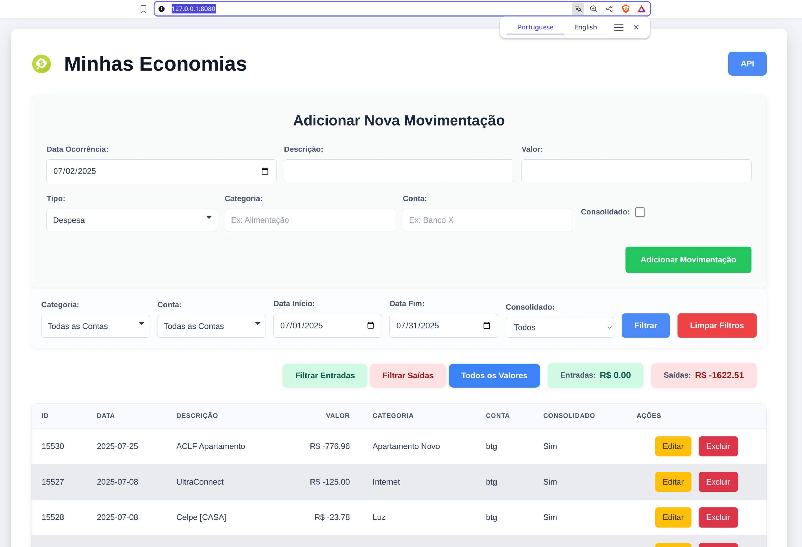

# Minhas Economias: Gestão Financeira Pessoal (Web e CLI)

Este projeto oferece um sistema para gestão de movimentações financeiras pessoais, permitindo a importação e exportação de dados via linha de comando, e a visualização, filtragem, adição, edição e exclusão de registros através de uma interface web moderna.



## Descrição

Minhas Economias é uma ferramenta desenvolvida em Go, utilizando o framework Gin para a aplicação web e SQLite como banco de dados. O objetivo é fornecer uma maneira eficiente e organizada de acompanhar suas finanças, com foco em simplicidade e usabilidade.

## Funcionalidades

### Aplicação Web

* **Visualização de Movimentações**: Exibe uma tabela com todas as movimentações financeiras, com alternância de cores nas linhas para melhor legibilidade.

* **Filtros Avançados**:

    * **Período**: Filtra por um intervalo de datas (Data Início e Data Fim). Por padrão, exibe o mês corrente.

    * **Categorias Múltiplas**: Selecione uma ou mais categorias via checkboxes em um dropdown personalizado.

    * **Contas Múltiplas**: Selecione uma ou mais contas via checkboxes em um dropdown personalizado.

    * **Consolidado**: Filtra por movimentações consolidadas (Sim/Não/Todos).

    * **Entradas/Saídas**: Botões dedicados para filtrar apenas movimentações positivas ("Filtrar Entradas") ou negativas ("Filtrar Saídas"), além de "Todos os Valores".

* **Resumo Financeiro**:

    * **Total Consolidado**: Mostra a soma total dos valores filtrados em uma tabela separada.

    * **Entradas**: Exibe a soma de todas as movimentações positivas (receitas) dentro do filtro, em um botão de resumo.

    * **Saídas**: Exibe a soma de todas as movimentações negativas (despesas) dentro do filtro, em um botão de resumo.

* **Adição de Novas Movimentações**:

    * Formulário intuitivo para inserir novos registros, localizado no topo da página.

    * **Data Padrão**: A data atual é sugerida automaticamente.

    * **Tipo (Receita/Despesa)**: Selecione se é uma receita (valor positivo) ou despesa (valor negativo) usando um dropdown personalizado. A "Despesa" é o padrão. O sistema ajusta o sinal do valor automaticamente.

    * **Autopreenchimento de Categoria e Conta**: Sugestões baseadas em registros existentes enquanto você digita, utilizando `datalist`.

    * **Conta Obrigatória**: Garante que uma conta seja sempre informada.

    * **Categoria Padrão**: Se a categoria não for preenchida, é definida como "Sem Categoria".

    * **Valor Padrão**: Se o valor não for preenchido, é definido como 0.

    * **Consolidado Padrão**: O campo "Consolidado" vem desmarcado por padrão.

* **Edição de Movimentações**:

    * Botão "Editar" em cada linha da tabela.

    * Preenche o formulário de adição com os dados da movimentação selecionada.

    * O título do formulário e o botão de envio mudam para "Salvar Alterações".

    * Um botão "Cancelar Edição" permite reverter o formulário para o modo de adição.

* **Exclusão de Movimentações**:

    * Botão "Excluir" em cada linha da tabela.

    * Solicita confirmação antes de deletar um registro.

* **Visualização JSON da API**: Um botão "API" permite ver os dados filtrados em formato JSON através da API.

### Ferramenta CLI (`data_manager.go`)

Uma ferramenta de linha de comando para gerenciar a importação e exportação em massa de dados do `extratos.db`.

* **Importação (`-import`)**: Lê arquivos CSV de um diretório especificado e insere os dados no banco de dados SQLite.

    * **Formato CSV esperado**: `Data Ocorrência;Descrição;Valor;Categoria;Conta;Consolidado` (com ponto e vírgula como delimitador).

* **Exportação (`-export`)**: Extrai todas as movimentações do banco de dados SQLite e gera um único arquivo CSV no formato de importação.

    * **Caminho de Saída (`-output-path`)**: Permite especificar o diretório e o nome do arquivo CSV de saída (ex: `-output-path backup/meu_extrato.csv`).

### Ferramenta CLI (`xls_to_csv.go`)

Um programa auxiliar para converter arquivos XLS antigos (que podem estar em codificação Windows-1252) para o formato CSV compatível com o `data_manager.go`.

* **Função**: Converte planilhas XLS (especificamente a primeira aba) para CSV, tratando a codificação e adicionando a coluna "Consolidado" com valor "true" (assumindo que extratos antigos são consolidados).

* **Uso**: Execute-o diretamente, ele processará uma lista pré-definida de arquivos XLS e salvará os CSVs no diretório `csv/`.

    ```bash
    go run xls_to_csv.go
    ```

    (Certifique-se de que os arquivos XLS de entrada estejam no diretório `xls/` conforme configurado no código).

## Estrutura do Projeto

O projeto é modularizado para facilitar a manutenção e o desenvolvimento:

````

minhas\_economias/
├── main.go                       \# Ponto de entrada da aplicação web, inicializa o servidor Gin e rotas.
├── extratos.db                   \# Banco de dados SQLite (gerado e gerenciado por data\_manager.go e a webapp).
├── templates/                    \# Contém os templates HTML.
│   └── index.html                \# A interface principal da aplicação web.
├── static/                       \# Contém arquivos estáticos (CSS, ícones, imagens).
│   ├── css/
│   │   └── style.css             \# Estilos CSS da aplicação.
│   ├── minhas\_economias.ico      \# Ícone da aplicação.
│   └── minhas\_economias.png      \# Imagem do logo no cabeçalho.
├── models/                       \# Definições de modelos de dados.
│   └── movimentacao.go           \# Estrutura (struct) para Movimentação.
├── database/                     \# Lógica de conexão e interação com o banco de dados.
│   └── sqlite.go                 \# Funções para inicializar e gerenciar a conexão SQLite.
└── handlers/                     \# Funções que lidam com as requisições HTTP (controladores).
└── movimentacoes.go          \# Lógica para GET, POST, PUT, DELETE de movimentações.

````

**Observação**: Os arquivos `data_manager.go` e `xls_to_csv.go` (que lidam com importação/exportação/conversão) ficam na raiz do projeto, separados da estrutura de pacotes da aplicação web, por serem ferramentas utilitárias de linha de comando.

## Tecnologias Utilizadas

* **Backend**:

    * [Go](https://golang.org/)

    * [Gin Web Framework](https://gin-gonic.com/)

    * [SQLite](https://www.sqlite.org/index.html) (via `github.com/mattn/go-sqlite3`)

* **Frontend**:

    * HTML5

    * CSS3

    * JavaScript

    * [Tailwind CSS (CDN)](https://tailwindcss.com/docs/installation/play-cdn) (para prototipagem rápida de estilos)

* **Ferramentas Auxiliares Go**:

    * `github.com/shakinm/xlsReader/xls`

    * `github.com/xuri/excelize/v2`

    * `golang.org/x/text/encoding/charmap`

## Como Começar

Siga estas instruções para configurar e executar o projeto em sua máquina local.

### Pré-requisitos

Certifique-se de ter o Go instalado em sua máquina. Você pode baixá-lo em [golang.org/dl](https://golang.org/dl/).

### 1. Clonar o Repositório

```bash
git clone [https://github.com/laurobmb/minhas_economias.git](https://github.com/laurobmb/minhas_economias.git)
cd minhas_economias
````

### 2\. Inicializar o Módulo Go e Baixar Dependências

No diretório raiz do projeto (`minhas_economias/`), execute:

```bash
go mod init minhas_economias # Se você não usou este nome, ajuste para o que usou
go mod tidy
```

### 3\. Configurar Estrutura de Arquivos

Certifique-se de que os diretórios `templates/`, `static/css/`, `static/`, `csv/` e `xls/` existam, e que os arquivos estejam em seus devidos lugares.

  * `templates/index.html`

  * `static/css/style.css`

  * `static/minhas_economias.ico`

  * `static/minhaseconomias.png` (Coloque a imagem do logo aqui)

  * Coloque seus arquivos XLS originais no diretório `xls/`.

  * O diretório `csv/` será criado pelo `xls_to_csv.go` e conterá os CSVs convertidos.

### 4\. Usar a Ferramenta CLI para Conversão (Opcional, se tiver XLS)

Se você tem arquivos XLS antigos e precisa convertê-los para CSV antes de importar:

  * **Para converter arquivos XLS para CSV**:

    ```bash
    go run xls_to_csv.go
    ```

    Isso lerá os XLS do diretório `xls/` e gerará os CSVs correspondentes no diretório `csv/`.

### 5\. Usar a Ferramenta CLI (Importar/Exportar)

O arquivo `data_manager.go` é responsável por gerenciar a importação e exportação de dados.

  * **Para importar dados de CSVs para o `extratos.db`**:

    ```bash
    go run data_manager.go -import
    ```

    (Certifique-se de que a lista `csvFiles` em `data_manager.go` aponte para seus arquivos CSV corretamente, preferencialmente os gerados pelo `xls_to_csv.go`).

  * **Para exportar dados do `extratos.db` para um CSV**:

    ```bash
    go run data_manager.go -export
    # Ou para um caminho específico:
    go run data_manager.go -export -output-path backup/meu_extrato_completo.csv
    ```

### 6\. Executar a Aplicação Web

No diretório raiz do projeto (`minhas_economias/`), execute:

```bash
go run main.go
```

Após a execução, o servidor estará ativo em `http://localhost:8080`.

## Uso

### Aplicação Web (`http://localhost:8080`)

  * **Navegação**: Acesse a URL no seu navegador.

  * **Filtros**: Use os campos "Categoria", "Conta", "Data Início", "Data Fim" e "Consolidado" para refinar a visualização dos dados.

      * Para Categoria e Conta, clique no campo para abrir as opções com checkboxes e selecione múltiplas.

      * A primeira carga da página e as limpezas de filtro exibirão os dados do mês corrente por padrão.

      * Use os botões "Filtrar Entradas", "Filtrar Saídas" e "Todos os Valores" para filtros rápidos por sinal do valor.

  * **Adicionar Movimentação**: Preencha o formulário "Adicionar Nova Movimentação".

      * Escolha "Receita" ou "Despesa" (Despesa é o padrão). O valor será automaticamente ajustado para positivo ou negativo.

      * Use o autopreenchimento para Categoria e Conta (ou digite um novo valor).

      * O campo "Conta" é obrigatório.

      * A data atual é pré-preenchida.

  * **Editar Movimentação**: Clique no botão "Editar" na linha desejada. O formulário de adição será preenchido. Faça suas alterações e clique em "Salvar Alterações". Use "Cancelar Edição" para voltar ao modo de adição.

  * **Excluir Movimentação**: Clique no botão "Excluir" na linha desejada e confirme a exclusão.

### Ferramenta CLI (`data_manager.go`)

Execute a ferramenta no terminal usando as flags:

  * `go run data_manager.go -import`

  * `go run data_manager.go -export`

  * `go run data_manager.go -export -output-path caminho/do/arquivo.csv`

### Ferramenta CLI (`xls_to_csv.go`)

Execute a ferramenta no terminal:

  * `go run xls_to_csv.go`

## Melhorias Futuras

  * **Autenticação de Usuários**: Implementar um sistema de login para múltiplos usuários.

  * **Relatórios Financeiros**: Gerar gráficos e relatórios mais detalhados.

  * **Categorias e Contas Dinâmicas**: Gerenciar categorias e contas diretamente pela interface web.

  * **Validação de Formulário no Frontend**: Adicionar validações JavaScript mais robustas para feedback instantâneo ao usuário.

  * **Otimização de Querys**: Para grandes volumes de dados, considerar índices no SQLite.

  * **Migrações de Banco de Dados**: Ferramentas para gerenciar alterações de esquema (ex: `golang-migrate`).

## Licença

Este projeto é de código aberto e está disponível sob a licença [MIT](https://opensource.org/licenses/MIT) (exemplo).

