# Galeria de Imagens do Projeto

Este documento apresenta as principais telas e funcionalidades da aplicação "Minhas Economias".

## Login

## Registro
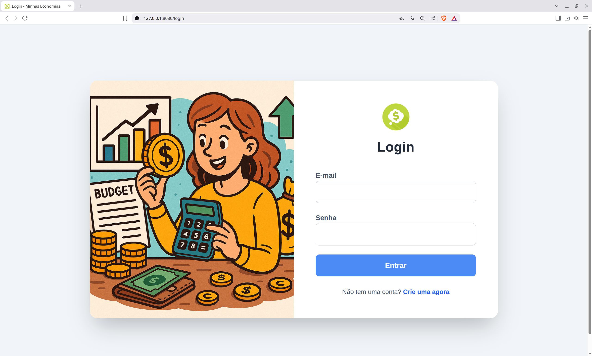

## Painel de Saldos
#### Tema Claro
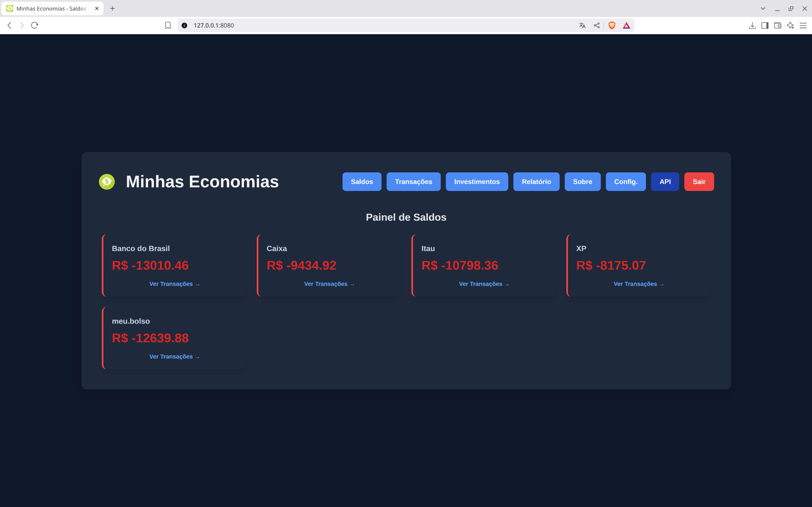
#### Tema Escuro

## Página de Transações
#### Tema Claro
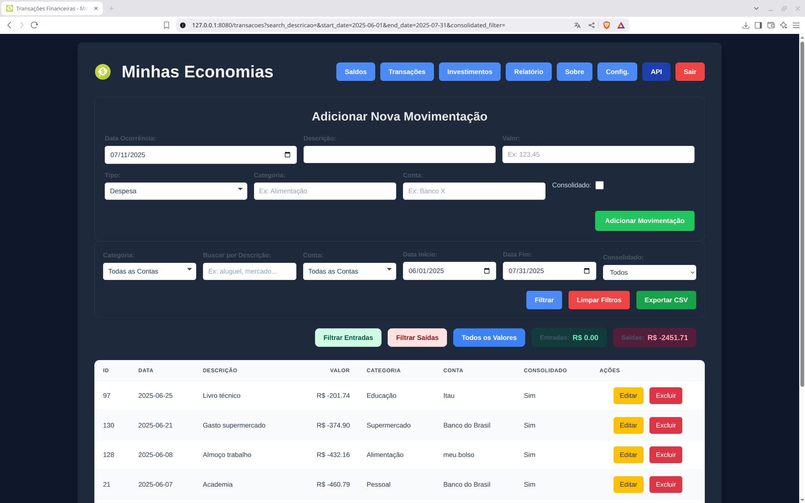
#### Tema Escuro
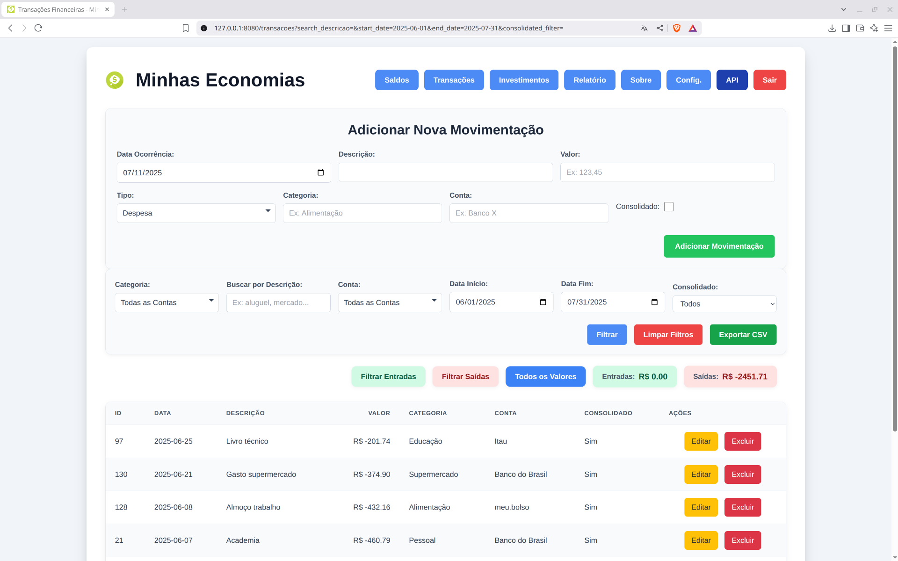

## Relatório de Despesas
#### Tema Claro
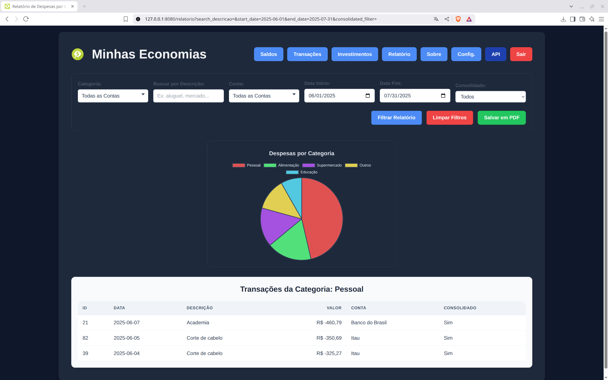
#### Tema Escuro
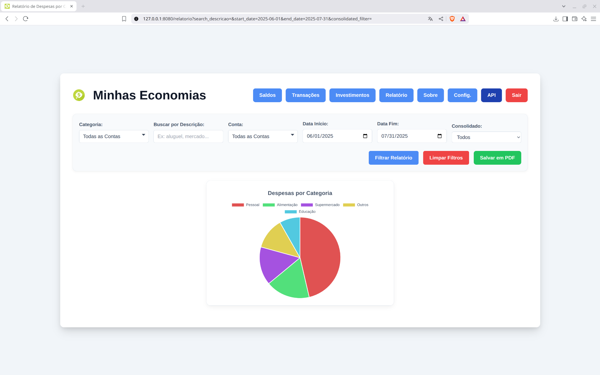

## Página de Investimentos
#### Tema Claro
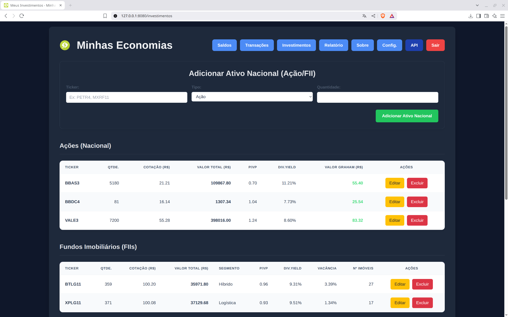
#### Tema Escuro
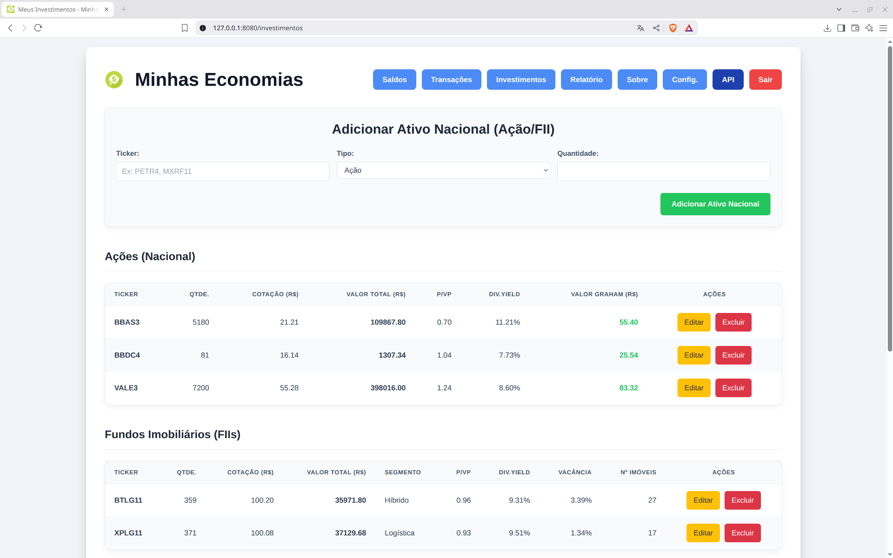

## Página de Configurações
#### Tema Claro
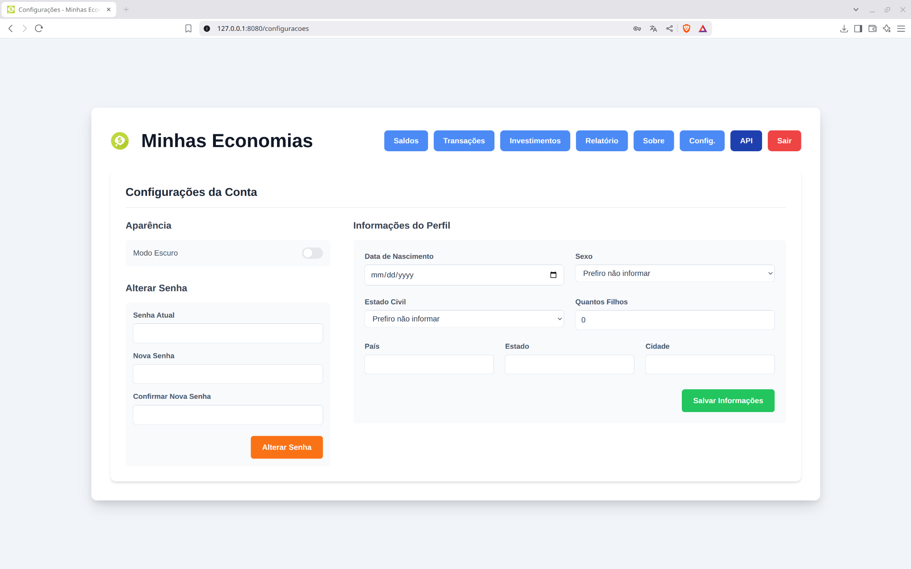

## Página de Sobre
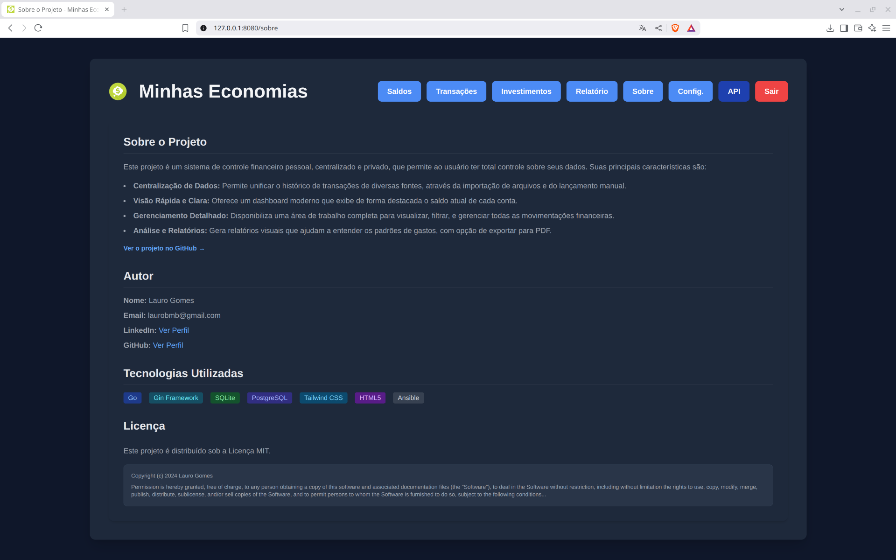

## Resposta da API (JSON)
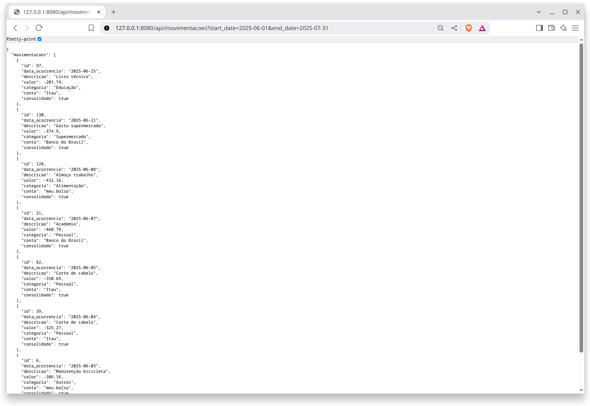

## Formato de Importação de XLS
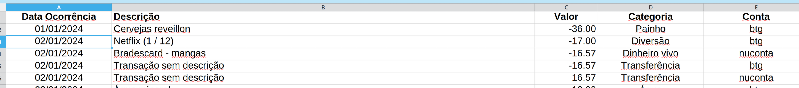
