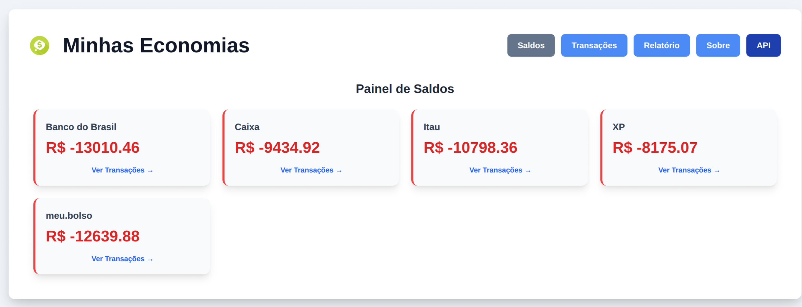
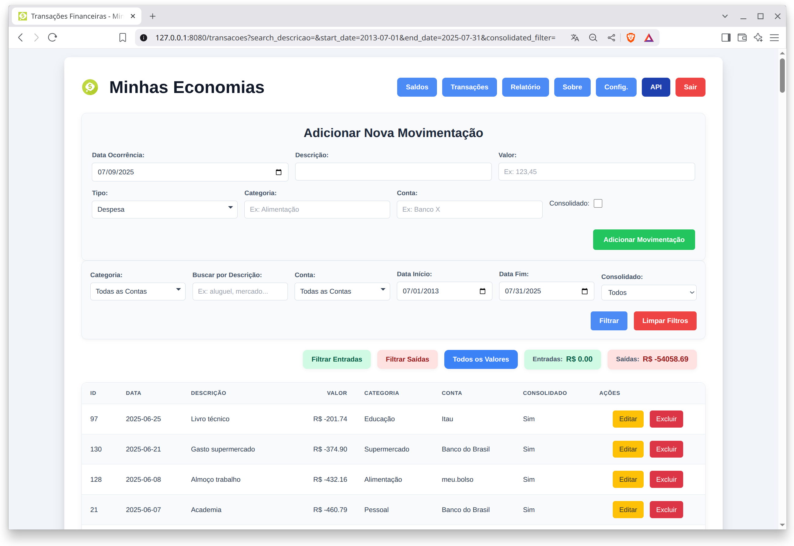
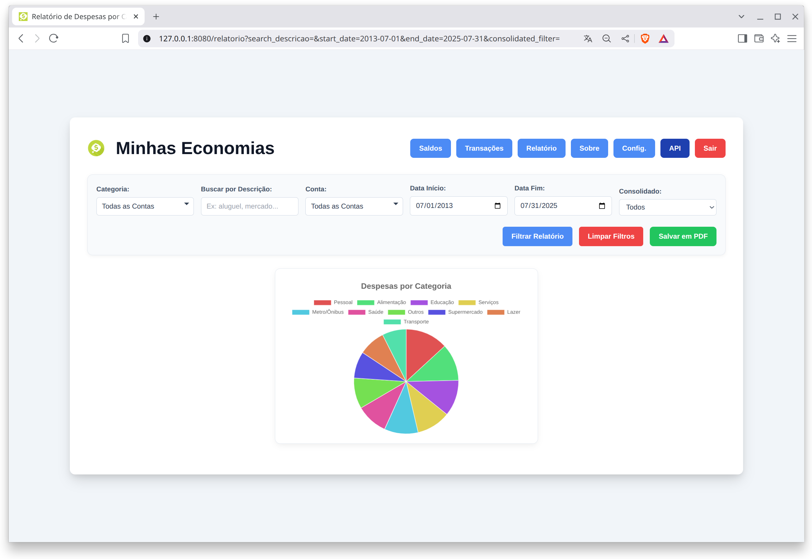
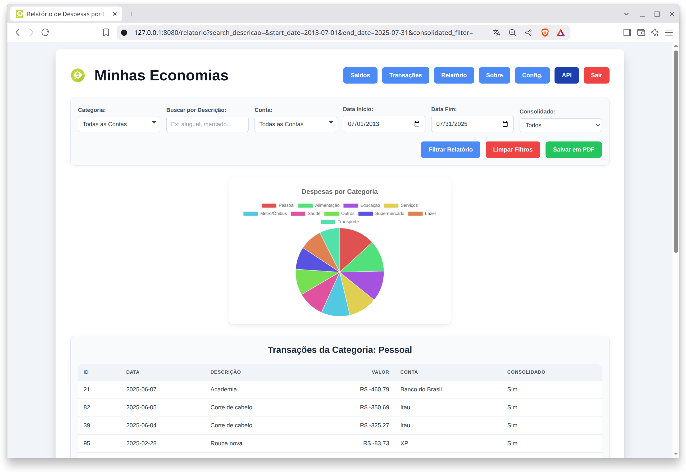
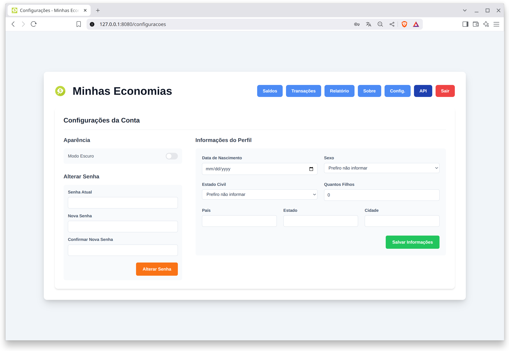
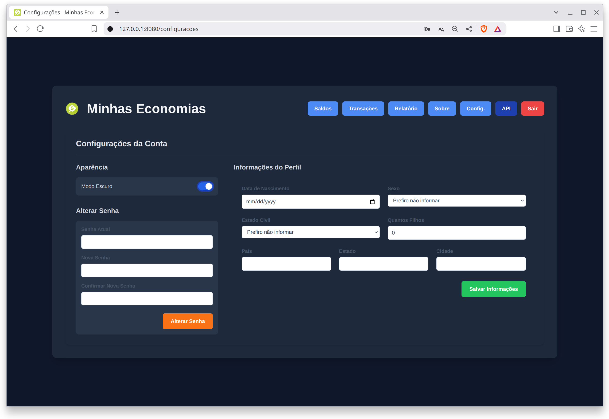
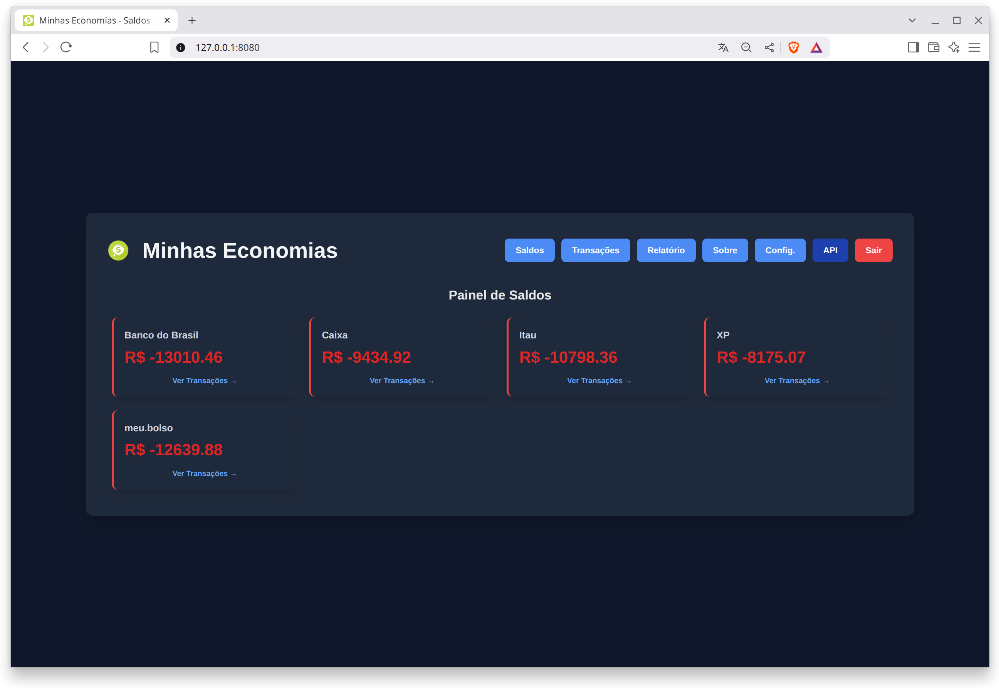
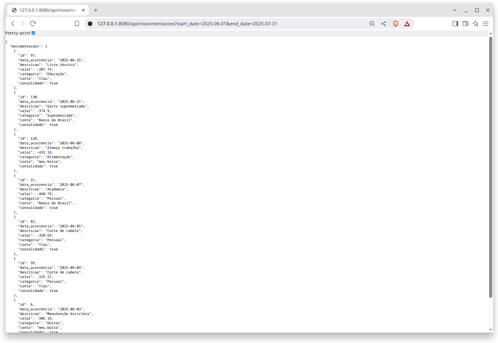

# Galeria de Imagens do Projeto

Este documento apresenta as principais telas e funcionalidades da aplicação "Minhas Economias".

## Painel de Saldos (Tema Claro)

## Página de Transações

## Relatório de Despesas

## Detalhes do Relatório

## Página de Configurações (Tema Claro)

## Página de Configurações (Tema Escuro)

## Painel de Saldos (Tema Escuro)

## Resposta da API (JSON)

## Formato de Importação de XLS

